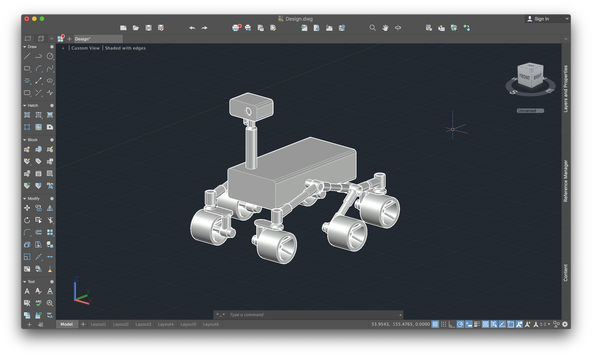
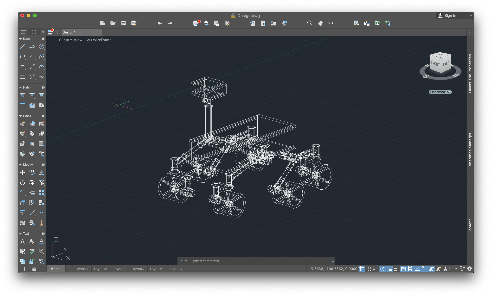
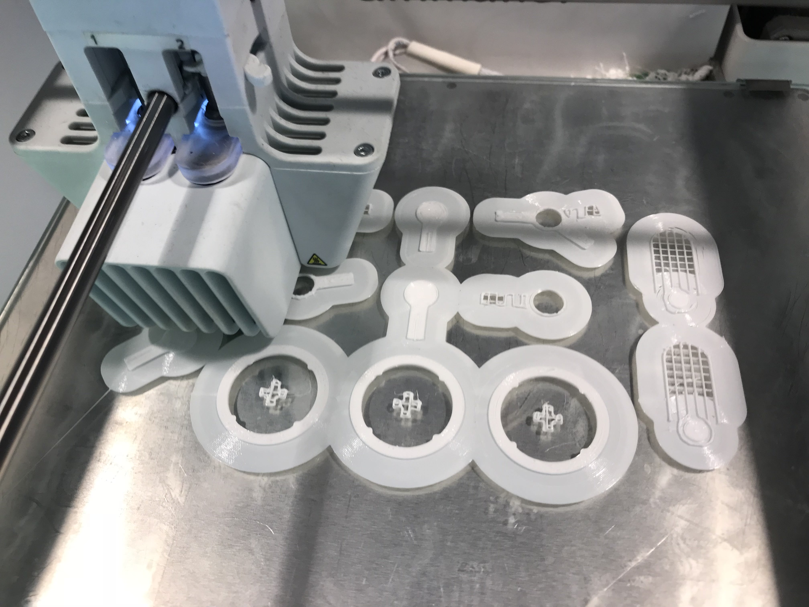
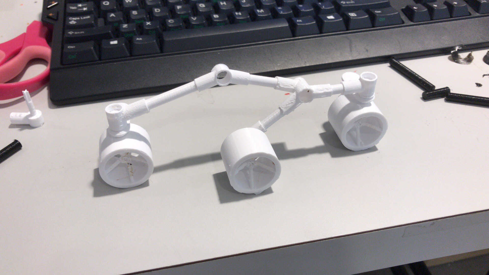

# SEDS_Rover
All of the files for the rover being built by UNC_SEDS

Sections for the repo:

## HARDWARE:
CAD files, designs, etc for the rover. The locomotion architecture is the same
rocker-bogie design that is used on multiple real Martian rovers.

Overall design of the rover

A 2D wireframe view.

Printing components of the rover

One side of legs assembled

All versions of the rover

Rocker-bogie design ensures that the rover's main body stays flat independt of
the motion of two legs.

## SOFTWARE:
Arduino code
List of software libraries, etc

## OPERATIONS:
Promotional materials, etc, for stuff that is appropiate

## TUTORIALS:
Various files and links to tutorials
